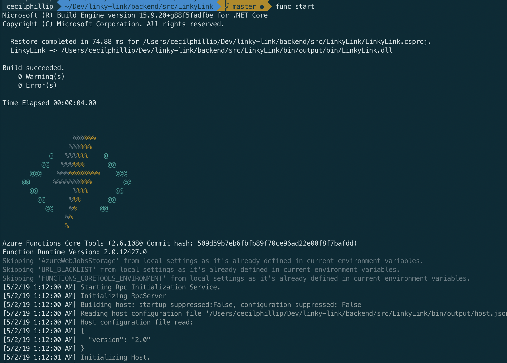
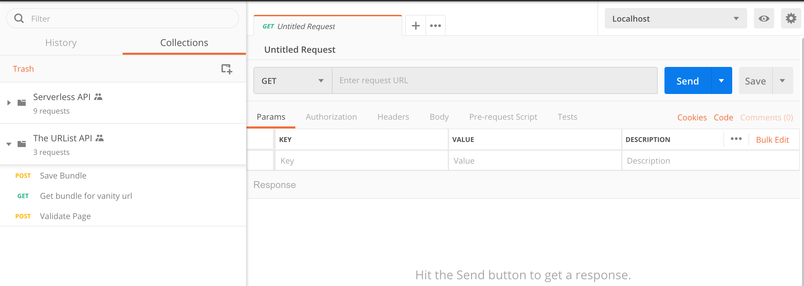
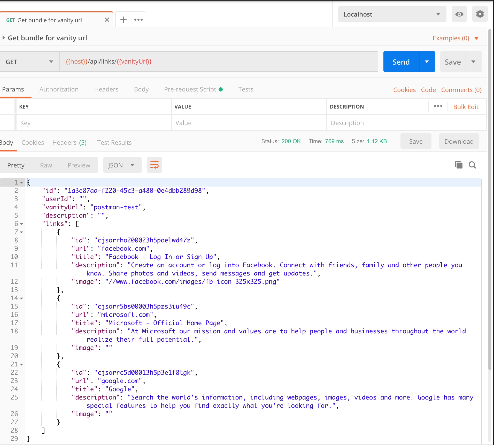

# The Urlist - Backend
The backend for this project was built as a serverless API using Azure Functions and .NET. All the data is stored in a Cosmos DB collection using the SQL API.
* [.NET Core](https://dotnet.microsoft.com?WT.mc_id=theurlist-github-cephilli)
* [Azure Functions](https://azure.microsoft.com/services/functions/?WT.mc_id=theurlist-github-cephilli)
* [Azure Cosmos DB](https://azure.microsoft.com/services/cosmos-db?WT.mc_id=theurlist-github-cephilli)


## Build and run the backend locally

### Get the prerequisites
* Install the [Azure Functions Core tools](https://docs.microsoft.com/azure/azure-functions/functions-run-local?WT.mc_id=theurlist-github-cephilli#install-the-azure-functions-core-tools) for your operating system
* Install the [.NET Core SDK](https://dotnet.microsoft.com/download?WT.mc_id=theurlist-github-cephilli). This repo is pinned to use version 2.2.x of the SDK.
* Install [Visual Studio Code](https://code.visualstudio.com/?WT.mc_id=theurlist-github-cephilli) or [Visual Studio Community edition](https://visualstudio.microsoft.com/vs?WT.mc_id=theurlist-github-cephilli)
*  Install the [C# extension for Visual Studio Code](https://marketplace.visualstudio.com/items?itemName=ms-vscode.csharp&WT.mc_id=theurlist-github-cephilli)
* Install the [Azure Functions for VS Code](https://marketplace.visualstudio.com/items?itemName=ms-azuretools.vscode-azurefunctions?WT.mc_id=theurlist-github-cephilli) extension

#### Optional
* Install [Postman](https://www.getpostman.com/)

### Run the serverless backend

Navigate into backend folder
```bash
cd backend/src/LinkyLink
```

Build the project
```bash
dotnet build
```

Rename the `local.settings.sample.json` file to `local.settings.json`

Linux & MacOS
```bash
mv local.settings.sample.json local.settings.json
```

Windows command line
```bash
REN local.settings.sample.json local.settings.json
```

Update the `local.settings.json` file with your Application Insights key to the `APPINSIGHTS_INSTRUMENTATIONKEY` setting. You could also just remove this if you don't want to use Application Inisghts.

[Create an a Cosmos DB instance](https://docs.microsoft.com/en-us/azure/cosmos-db/how-to-manage-database-account?WT.mc_id=theurlist-github-cephilli) in Azure using the SQL API. Update the `local.settings.json` file with your Cosmos DB connection string in the `LinkLinkConnection` settings. This database will initially be empty. If you try out the API with Postman (see below), the collection and sample documents will be created for you automatically. Otherwise it's structure will be created when you create your first list through the frontend.

Start the function via the command line
```bash
func start
```



Alternatively, start a debuging session in `Visual Studio` or  `Visual Studio Code`.

### Try out the API with Postman

* Start up Postman and import the `theurlist_collection.json` file that's in the `backend` folder
* Next import the `theurlist_localhost_env.json` file. That includes the Localhost environment settings.
* Set your environment to `Localhost`



* Run `Save Bundle` to add some data to Cosmos DB. The structure (collection, documents, etc.) in the database will be created for you if it does not exsist yet. Next run `Get bundle for vanity url` to retrieve the entry you just created.

If everything was setup correctly, your should see a response that resembles the following.

